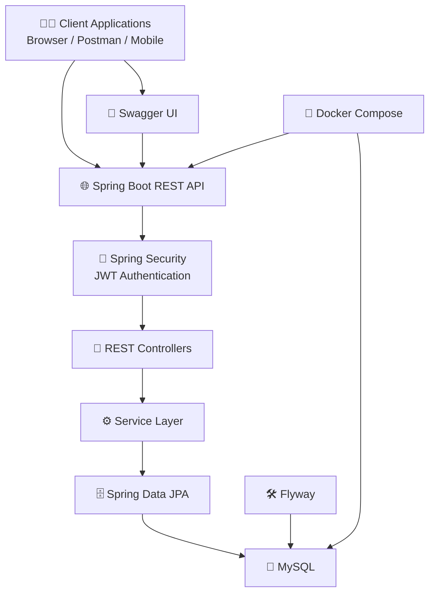

# 🍽️ Restaurant Management System API


A production-inspired **Restaurant Management REST API** built using **Spring Boot**, designed to streamline restaurant operations through secure authentication, role-based authorization, customer and staff management, reservations, ordering, event management, and business analytics.

---

# 🚀 Technology Stack

| Technology | Version |
|------------|---------|
| Java | 21 |
| Spring Boot | 3.5.4 |
| Spring Security | 6.5.2 |
| JWT Authentication | JJWT 0.12.x |
| Spring Data JPA | 3.5.4 |
| Hibernate ORM | Managed by Spring Boot |
| Flyway | Database Migration |
| MySQL | 8.0 |
| Swagger UI (OpenAPI) | 2.8.9 |
| Docker & Docker Compose | 29.x |
| Maven | Latest |

---

# 📖 Project Overview

The Restaurant Management System API provides a secure backend solution for managing restaurant operations.

It supports multiple user roles including customers, waiters, chefs, managers, and delivery drivers while offering features such as:

- Secure JWT Authentication
- Role-Based Access Control
- Customer & Staff Management
- Table Reservations
- Food Ordering
- Event Booking
- Restaurant Analytics
- Dockerized Deployment
- Automatic Database Migration with Flyway

---

# 🏗️ System Architecture



---

# ✨ Features

## 🔐 Authentication & Authorization

- JWT-based Authentication
- Secure Login & Registration
- Password Encryption
- Role-Based Access Control (RBAC)

Supported Roles:

- CUSTOMER
- WAITER
- CHEF
- MANAGER
- DELIVERY_DRIVER

---

## 👤 Customer Management

Customers can:

- Register and Login
- Create Customer Profiles
- View Order History
- View Event History
- Browse Menu
- Book Restaurant Tables
- Place Orders
- Register for Events

---

## 👨‍🍳 Staff Management

Staff members can:

- Register and Login
- Create Staff Profiles
- View Assigned Shifts
- Track Hours Worked

Staff Roles:

- Waiter
- Chef
- Manager
- Delivery Driver

---

## 🍽️ Restaurant Operations

### Table Reservations

- Check Table Availability
- Book Tables for Specific Dates & Time Slots

---

### Food Ordering

Supports:

- Dine-In
- Takeaway
- Delivery

Staff can:

- Accept Orders
- Process Orders
- Complete Orders

---

### Menu Management

Staff can:

- View Menu
- Add Special Menu Items

---

### Event Management

Customers can:

- Register for Events

Staff can:

- Manage Event Bookings

---

## 📊 Manager Dashboard

Managers can:

- Assign Staff Shifts
- View Top 5 Busiest Booking Periods
- View Top 5 Menu Items
- View Top 5 Staff by Hours Worked
- View Top 5 Active Customers

---

# 🗄️ Database

The application uses:

- MySQL 8
- Spring Data JPA
- Hibernate ORM
- Flyway Database Migration

During startup Flyway automatically:

- Creates the database schema
- Executes all migration scripts
- Seeds the database with sample menu items

No manual SQL setup is required.

---

# 📂 Project Structure

```
src
├── controllers
├── services
├── repositories
├── entities
├── dto
├── security
├── config
├── exception
├── mappers
└── resources
    ├── db
    │   └── migration
    └── application.yaml
```

---

# 🐳 Running the Project

## Clone Repository

```bash
git clone https://github.com/auxi0ngg/Restaurant-management-system-springboot.git

cd Restaurant-management-system-springboot
```

---

## Start using Docker

```bash
docker compose up --build
```

Docker automatically:

- Builds the application
- Starts MySQL
- Executes Flyway Migrations
- Starts the Spring Boot application

---

# 📚 API Documentation

Swagger UI:

```
http://localhost:8080/swagger-ui.html
```

Use Swagger UI to explore and test every API endpoint.

---

# 🔑 Authentication Flow

Before accessing secured endpoints:

1. Register a User
2. Login
3. Receive JWT Token
4. Create Customer or Staff Profile
5. Use JWT in Authorization Header

```
Authorization: Bearer <your-jwt-token>
```

---

# 👤 Customer Example

## Register

**POST**

```
/users
```

```json
{
  "email": "customer@example.com",
  "password": "password",
  "role": "CUSTOMER"
}
```

---

## Login

**POST**

```
/auth/login
```

```json
{
  "email": "customer@example.com",
  "password": "password"
}
```

Response

```json
{
  "token": "generated-json-web-token"
}
```

---

## Create Customer Profile

**POST**

```
/customers
```

Headers

```
Authorization: Bearer <JWT_TOKEN>
```

Body

```json
{
  "firstName": "Dave",
  "lastName": "Wilson",
  "houseNumber": "2",
  "street": "King Street",
  "postcode": "LS2976P"
}
```

---

# 👨‍🍳 Staff Example

## Register

**POST**

```
/users
```

```json
{
  "email": "staff@example.com",
  "password": "password",
  "role": "WAITER"
}
```

---

## Login

**POST**

```
/auth/login
```

```json
{
  "email": "staff@example.com",
  "password": "password"
}
```

Response

```json
{
  "token": "generated-json-web-token"
}
```

---

## Create Staff Profile

**POST**

```
/staff
```

Headers

```
Authorization: Bearer <JWT_TOKEN>
```

Body

```json
{
  "firstName": "Jay",
  "lastName": "Buckley"
}
```

---

# 🔒 Security

The API is secured using **Spring Security** and **JWT Authentication**.

Protected endpoints require:

```
Authorization: Bearer <JWT_TOKEN>
```

Passwords are securely encrypted before storage.

---

# 📈 Future Improvements

Potential enhancements include:

- Email Notifications
- Payment Gateway Integration
- Inventory Management
- Redis Caching
- Kafka Event Streaming
- Kubernetes Deployment
- CI/CD with GitHub Actions
- Unit & Integration Test Coverage

---

# 👨‍💻 Author

**Arnav Garg**

- GitHub: https://github.com/auxi0ngg
- LinkedIn: https://www.linkedin.com/in/arnavgarg2003/

---

# ⭐ Support

If you found this project helpful, consider giving it a ⭐ on GitHub.
